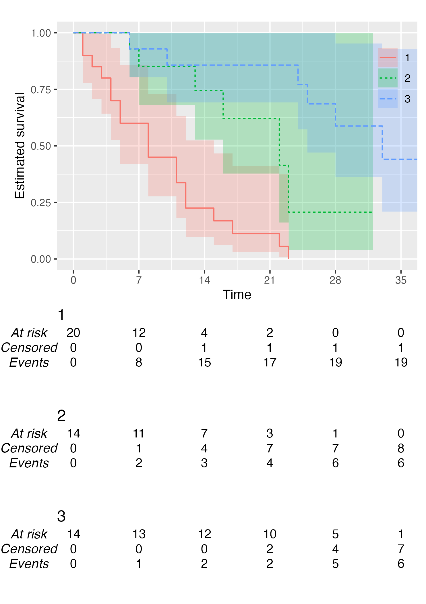
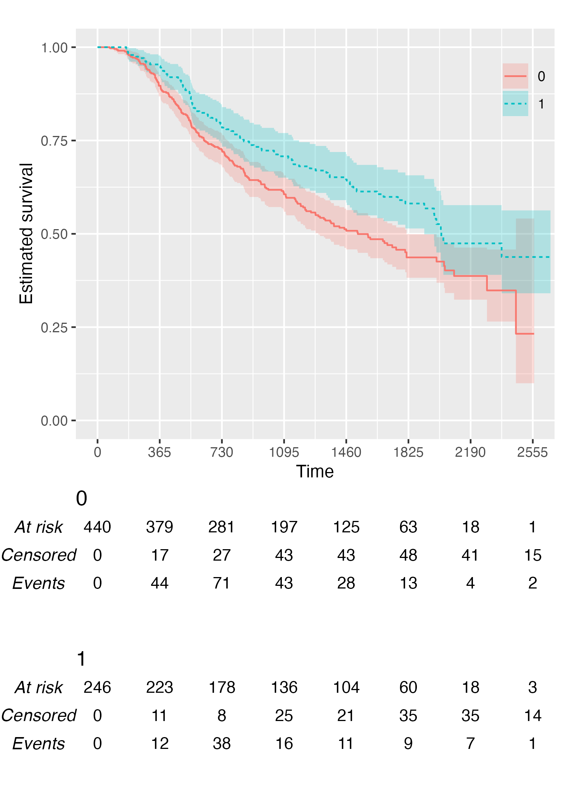

<!-- README.md is generated from README.Rmd. Please edit that file -->

# KMunicate

<!-- badges: start -->

[](https://github.com/ellessenne/KMunicate-package/actions)
[](https://app.codecov.io/gh/ellessenne/KMunicate-package?branch=master)
[](https://CRAN.R-project.org/package=KMunicate)
[](https://cran.r-project.org/package=KMunicate)
[](https://cran.r-project.org/package=KMunicate)
<!-- badges: end -->

README Last updated: 2022-12-19.

The goal of {KMunicate} is to produce Kaplan–Meier plots in the style
recommended following the [KMunicate
study](http://dx.doi.org/10.1136/bmjopen-2019-030215) (TP Morris *et
al*. Proposals on Kaplan–Meier plots in medical research and a survey of
stakeholder views: KMunicate. *BMJ Open*, 2019, 9:e030215).

## Installation

You can install {KMunicate} from
[CRAN](https://CRAN.R-project.org/package=KMunicate) by typing the
following in your R console:

``` r
install.packages("KMunicate")
```

Alternatively, you can install the dev version of {KMunicate} from
[GitHub](https://github.com/ellessenne/KMunicate-package/) with:

``` r
# install.packages("devtools")
devtools::install_github("ellessenne/KMunicate-package")
```

## Example

``` r
library(survival)
library(KMunicate)
```

The {KMunicate} package comes with a couple of bundled dataset, `cancer`
and `brcancer`. The main function is named `KMunicate`:

``` r
KM <- survfit(Surv(rectime, censrec) ~ hormon, data = brcancer)
time_scale <- seq(0, max(brcancer$rectime), by = 365)
KMunicate(fit = KM, time_scale = time_scale)
```


``` r
KM <- survfit(Surv(studytime, died) ~ drug, data = cancer2)
time_scale <- seq(0, max(cancer2$studytime), by = 7)
KMunicate(fit = KM, time_scale = time_scale)
```



You also might wonder, does this work with a single arm? Yes, yes it
does:

``` r
KM <- survfit(Surv(studytime, died) ~ 1, data = cancer2)
time_scale <- seq(0, max(cancer2$studytime), by = 7)
KMunicate(fit = KM, time_scale = time_scale)
```


Finally, you can also plot 1 - survival by using the argument
`.reverse = TRUE`:

``` r
KM <- survfit(Surv(rectime, censrec) ~ hormon, data = brcancer)
time_scale <- seq(0, max(brcancer$rectime), by = 365)
KMunicate(fit = KM, time_scale = time_scale, .reverse = TRUE)
```


## Customise Risk Table

By default, `KMunicate()` will build a risk table conform to the
KMunicate style, e.g., with cumulative number of events and censored
(the column-wise sum is equal to the total number of individuals at risk
per arm):

``` r
KM <- survfit(Surv(rectime, censrec) ~ hormon, data = brcancer)
time_scale <- seq(0, max(brcancer$rectime), by = 365)
KMunicate(fit = KM, time_scale = time_scale)
```


Alternatively, it is possible to customise the risk table via the
`.risk_table` argument. For instance, if one wants to have interval-wise
number of events and censored, just pass the `survfit` value to the
`.risk_table` argument:

``` r
KMunicate(fit = KM, time_scale = time_scale, .risk_table = "survfit")
```



This is the default output of the `summary.survfit()` function.

Finally, it is also possible to fully omit the risk table by setting
`.risk_table = NULL`:

``` r
KMunicate(fit = KM, time_scale = time_scale, .risk_table = NULL)
```


## Custom Fonts

Assuming you have set up your computer to use custom fonts with
`ggplot2`, customising your KMunicate-style plot is trivial. All you
have to do is pass the font name as the `.ff` argument:

``` r
KM <- survfit(Surv(studytime, died) ~ 1, data = cancer2)
time_scale <- seq(0, max(cancer2$studytime), by = 7)
KMunicate(fit = KM, time_scale = time_scale, .ff = "Times New Roman")
```


## Further Customisation

Several options to further customise each plot are provided, see
e.g. the introductory vignette for more details.
